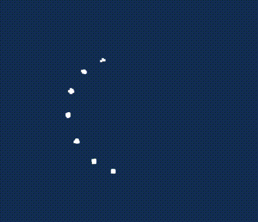
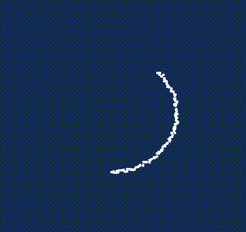

# three-js-trail

一个 `THREE` 拖尾实现

### 粒子支持快速运动

| 不支持快速运动                               | 支持快速运动                         |
| -------------------------------------------- | ------------------------------------ |
|  |  |

> r159+ 依赖 updateRanges 功能

# 感谢

> 参考实现 https://github.com/mkkellogg/TrailRendererJS
