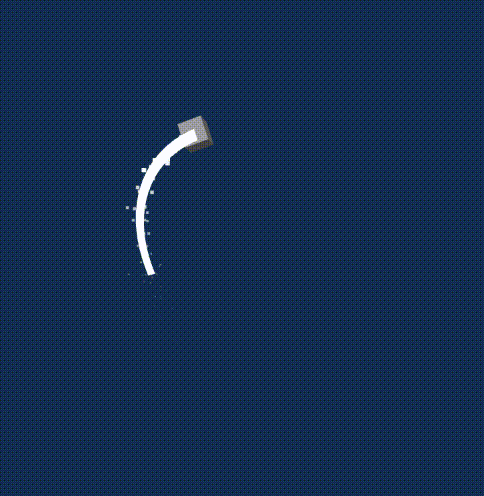
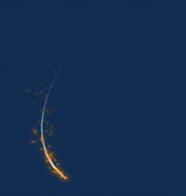
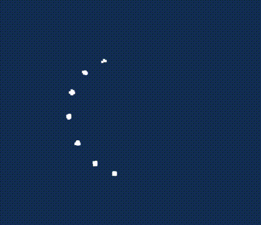
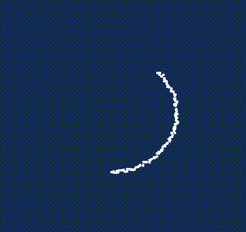

# three-js-trail

一个 `THREE` 几何拖尾+粒子拖尾实现

> r159+ 依赖 updateRanges 功能

| 默认                                 | 自定义材质                                         |
| ------------------------------------ | -------------------------------------------------- |
|  |  |

| 不支持快速运动                                           | 支持快速运动 ✅                                  |
| -------------------------------------------------------- | ------------------------------------------------ |
|  |  |

## 使用

```sh
> pnpm i three-js-trail -S
```
详细见[example/main.ts](./example/main.ts)
```ts
import { IUniform, Texture, Color, TextureLoader } from 'three';
import { Trail, TrailParticle, TrailMaterial, TrailParticleMaterial } from 'three-js-trail';

const trailDefault = new Trail(/* config */, /* TrailMaterial */, /* ShapeVertex */);
const trailParticleDefault = new TrailParticle(
  /* config */,
  /* TrailParticleMaterial */,
  /* shapeBufferGeometry */
);

// 自定义参数+材质
class CustomTrailMaterial extends TrailMaterial {
  static VERT = TrailMaterial.SG_VERT(/* glsl */ `varying vec2 vUV;`, /* glsl */ `vUV = uv;`);
  static FRAG = TrailMaterial.SG_FRAG(
    /* glsl */ `varying vec2 vUV; uniform sampler2D map;`,
    /* glsl */ `gl_FragColor.a = texture2D(map, vUV).r;`,
  );

  vertexShader = CustomTrailMaterial.VERT;
  fragmentShader = CustomTrailMaterial.FRAG;
  declare uniforms: TrailMaterial['uniforms'] & { map: IUniform<Texture | null> };

  constructor(map: Texture | null = null) {
    super();
    this.uniforms.map = { value: map };
  }
}

class CustomTrailParticleMaterial extends TrailParticleMaterial {
  static VERT = TrailParticleMaterial.SG_VERT(
    /* glsl */ `varying vec2 vUV;`,
    /* glsl */ `vUV = uv;`,
  );
  static FRAG = TrailParticleMaterial.SG_FRAG(
    /* glsl */ `varying vec2 vUV; uniform sampler2D map; uniform vec3 color;`,
    /* glsl */ `gl_FragColor = texture2D(map, vUV) * vec4(color, 1.);`,
  );

  vertexShader = CustomTrailParticleMaterial.VERT;
  fragmentShader = CustomTrailParticleMaterial.FRAG;
  declare uniforms: TrailParticleMaterial['uniforms'] & {
    map: IUniform<Texture | null>;
    color: IUniform<Color | null>;
  };

  constructor(map: Texture | null = null, color: Color | null = null) {
    super();
    this.uniforms.map = { value: map };
    this.uniforms.color = { value: color };
  }
}

const textureLoader = new TextureLoader();
const trailTexture = await textureLoader.loadAsync(trail);
const particleTexture = await textureLoader.loadAsync(particle);
const trailCustom = new Trail({}, new CustomTrailMaterial(trailTexture));
const trailParticleCustom = new TrailParticle(
  { size: 1, velocity: 2 },
  new CustomTrailParticleMaterial(particleTexture, new Color(0xffc107)),
);
```

# 感谢

> 参考实现 https://github.com/mkkellogg/TrailRendererJS
